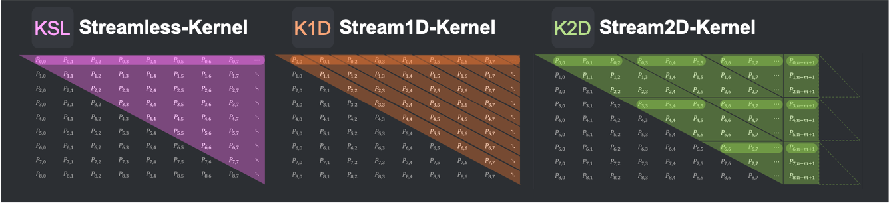

# Matrix Profile Computation on Xilinx FPGAs [](LICENSE.md) [](https://travis-ci.com/jlscheerer/matrix-profile-hls)

## Getting Started
### Cloning the repository
This project uses Google's open source testing and mocking framework [GoogleTest](https://github.com/google/googletest) to test the different kernels in software.

Since GoogleTest is included as a submodule, make sure to to clone the repository with ``--recursive`` if you plan on running the (software) tests. If the repository was cloned non-recursively previously, use ``git submodule update --init`` to clone the required submodule (GoogleTest).

### Prerequisites
To build and run the kernels in hardware (simulation) [Xilinx Vitis](https://www.xilinx.com/support/download/index.html/content/xilinx/en/downloadNav/vitis/2020-2.html) must be installed and the corresponding ``PATH``-variables must be set.

## Build and Run
### Configuration and Building
```bashs
mkdir build && cd build
cmake ..
make host
make compile
make link
make package_sd
```

### Launch the Emulator
```bash
make launch_emulator
```

### Running
```bash
./MatrixProfileHost -b MatrixProfileKernel.xclbin -i small8_syn --verbose
```
A list of example datasets as well as instruction on how to use your own dataset can be found [here](data/).

### Configure Environment Variables for Emulator
```bash
mount /dev/mmcblk0p1 /mnt
cd /mnt
export LD_LIBRARY_PATH=/mnt:/tmp:$LD_LIBRARY_PATH
export XCL_EMULATION_MODE=hw_emu
export XILINX_XRT=/usr
export XILINX_VITIS=/mnt
```
> Source: https://www.xilinx.com/html_docs/xilinx2020_2/vitis_doc/runemulation1.html

## Implementation

### Kernel Overview


## Testing
This project uses Google's open source testing and mocking framework [GoogleTest](https://github.com/google/googletest) to test the different kernels in software.

To build and run the test executables:
```bash
mkdir build && cd build
cmake .. -DSKIP_CHECKS=ON -DBUILD_TESTS=ON
make && make test
```

The corresponding source files can be found under [``test/TestStreamlessKernel.cpp``](test/TestStreamlessKernel.cpp), [``test/TestStream1DKernel.cpp``](test/TestStream1DKernel.cpp) and [``test/TestStream2DKernel.cpp``](test/TestStream2DKernel.cpp)

## Bugs
If you experience bugs, or have suggestions for improvements, please use the issue tracker to report them.